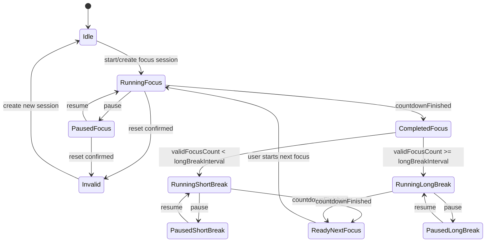
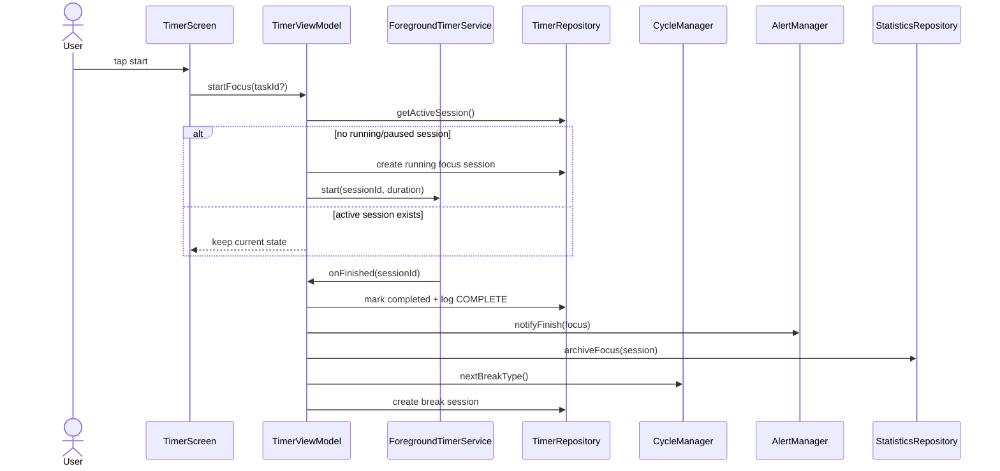
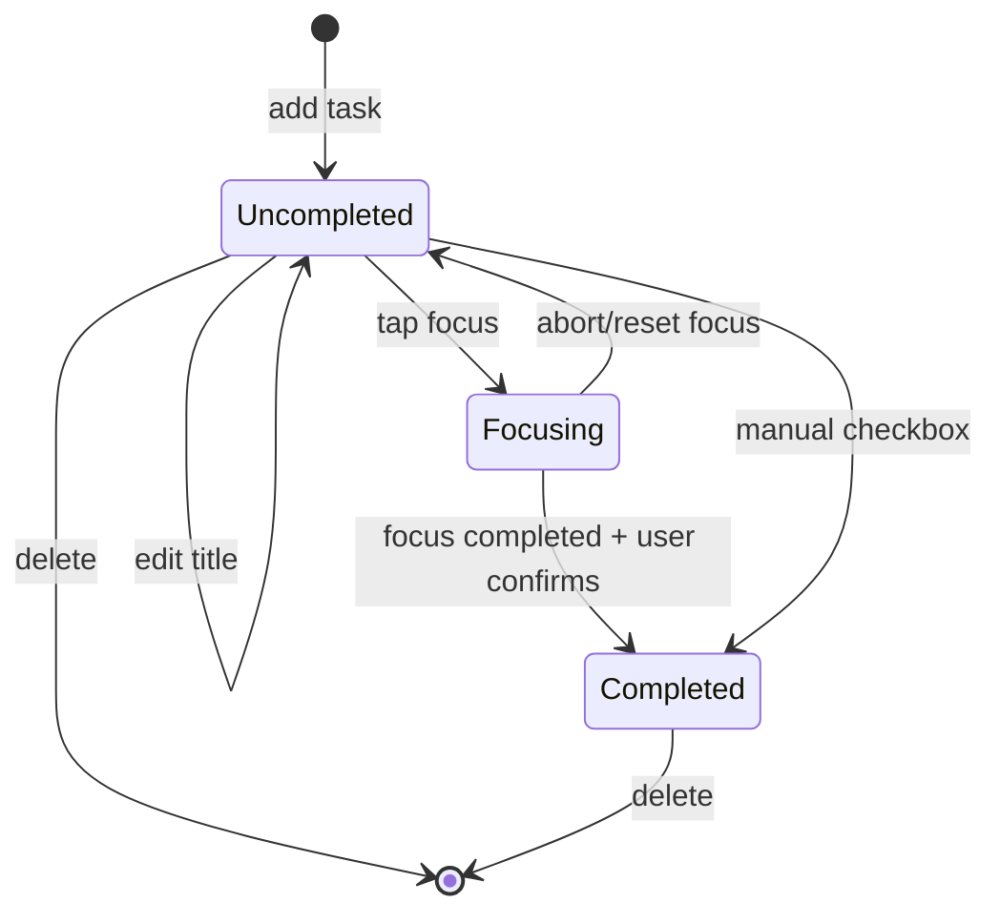
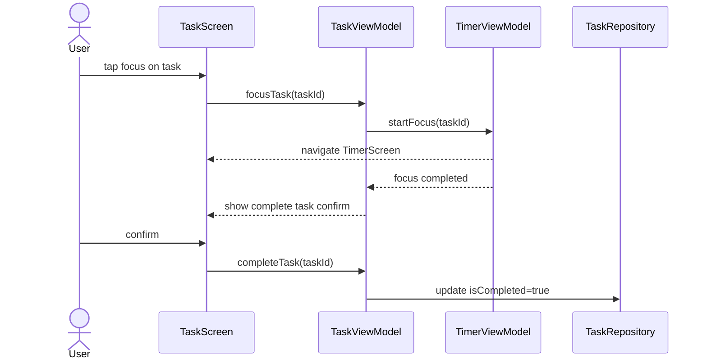

# 番茄钟 APP 编码上下文精简版

本文档是对当前目录中需求文档、设计文档、UML 图片和优先级 PDF 的编码前预处理。后续 Codex 实现代码时优先参考本文档；原始文件只在需要核对细节时查看。

## 1. 产品边界

- 目标：Android 本地离线番茄钟应用，跑通“任务计划 -> 专注计时 -> 周期提醒 -> 数据复盘 -> 配置调整”闭环。
- 用户：学生、备考、自习和个人时间管理用户。
- V1.0 不做：账号登录、多端同步、云备份、排行榜、社交分享、智能手表、子任务、标签、截止日期、联网推送。
- 数据全部本地保存，不需要网络权限。

## 2. 技术与架构约束

- 平台：Android 7.0/API 24+。
- 语言：优先 Kotlin。
- 架构：Single Activity + Navigation + MVVM + 单向数据流。
- 分层：Presentation -> ViewModel -> Domain/UseCase -> Repository -> Data(Room/DataStore/Service)。
- 持久化：Room 存结构化数据；DataStore 存配置。
- 后台计时：用前台 Service + 基于系统单调时间/elapsedRealtime 的时间差计算；不要依赖普通 Handler/CountDownTimer 作为唯一计时源。
- 核心逻辑要可单测：计时状态机、周期切换、统计归档、任务标题校验。
- 权限最小化：只申请提醒/通知相关必要权限。

建议模块：

```text
Presentation: TimerScreen, TaskScreen, StatsScreen, SettingsScreen
ViewModel:    TimerViewModel, TaskViewModel, StatsViewModel, SettingsViewModel
Domain:       TimerStateMachine, CycleManager, ArchiveFocusUseCase, ValidateTaskUseCase, AlertManager
Data:         Room DAO/Database, DataStore, ForegroundTimerService, Local Audio Assets
```

## 3. 实现优先级

1. 计时核心：启动计时 -> 暂停/继续/重置 -> 周期切换与提醒。
2. 任务管理：新增任务 -> 编辑/删除 -> 选择任务开始专注和完成任务。
3. 统计复盘：完成专注归档 -> 今日概览/7日趋势 -> 月度打卡。
4. 系统配置：时长配置 -> 音效/震动配置。

P0 主闭环必须先跑通：创建任务、关联任务启动专注、完成专注、归档统计、进入休息、配置下一周期生效。

## 4. 核心数据模型

### TimerSession / timer_sessions

```kotlin
TimerSession(
    sessionId: String,          // UUID, PK
    taskId: String?,            // 关联 Task；任务删除后置 null
    mode: TimerMode,            // focus, short_break, long_break
    plannedDurationSec: Int,
    remainingSec: Int,
    status: TimerStatus,        // idle, running, paused, completed, invalid
    startAt: Long,
    pauseAt: Long?,
    completedAt: Long?,
    resetAt: Long?,
    invalidReason: String?
)
```

### TimerOperationLog / timer_operation_logs

```kotlin
TimerOperationLog(
    logId: String,              // UUID, PK
    sessionId: String,
    operation: OperationType,   // start, pause, resume, reset, complete, restore
    operatedAt: Long,
    remainingSec: Int
)
```

### Task / tasks

```kotlin
Task(
    id: String,                 // UUID, PK
    title: String,              // 1..100 chars
    isCompleted: Boolean,
    createdAt: Long,
    completedAt: Long?,
    sortOrder: Int,
    priority: Int?,             // 预留，V1.0 不展示
    tag: String?,               // 预留，V1.0 不展示
    dueDate: Long?              // 预留，V1.0 不展示
)
```

### FocusRecord / focus_records

```kotlin
FocusRecord(
    id: String,                 // UUID, PK
    sessionId: String,          // UNIQUE，防重复归档
    linkedTaskId: String?,
    startTimestamp: Long,
    durationSeconds: Int,
    completedAt: Long,
    dateKey: String             // YYYY-MM-DD，按 completedAt 归属
)
```

### DailyFocusStats / daily_focus_stats

```kotlin
DailyFocusStats(
    dateKey: String,            // PK, YYYY-MM-DD
    tomatoCount: Int,
    totalFocusSeconds: Int,
    updatedAt: Long
)
```

### AppSettings / DataStore

```kotlin
AppSettings(
    focusDurationMin: Int = 25,       // 1..60
    shortBreakDurationMin: Int = 5,
    longBreakDurationMin: Int = 15,
    longBreakInterval: Int = 4,       // 2..8
    alertSound: String = "classic",   // classic, soft, pulse
    vibrationEnabled: Boolean = true
)
```

## 5. 计时核心规则

- idle 点击开始：创建 focus 会话，状态 running，默认 25 分钟或读取 DataStore 配置。
- start 需幂等：已有 running/paused 活动会话时忽略重复开始，不创建第二个计时器。
- running 点击暂停：停止递减，保存 remainingSec，状态 paused，写 PAUSE 日志。
- paused 点击继续：从 remainingSec 恢复，状态 running，写 RESUME 日志。
- reset：仅 running/paused 可触发；BottomSheet 二次确认后停止服务，将当前会话标为 invalid，写 RESET 日志，不计入完成统计。
- 应用重启：恢复最近一次 running/paused 会话。running 用单调时间差重算 remainingSec；paused 保持剩余时间不变。
- 系统时间被用户手动修改时，倒计时不应受影响。
- 专注完成：focus 会话标 completed，写 COMPLETE 日志，触发提醒，统计归档。
- invalid 会话不计入连续有效番茄数。
- 连续完成 longBreakInterval 个有效 focus 后进入 long_break，否则进入 short_break。
- 休息完成：触发提醒，创建/准备下一个 focus idle 会话，必须由用户手动点击开始。
- 提醒：前台至少弹窗或声音一种；后台显示系统通知；静音时降级为弹窗/震动。

计时状态机：



简化顺序：



## 6. 任务管理规则

- 添加：右下角 FAB 展开列表顶部内联输入框；标题 1..100 字符；空或超长内联报错；保存后加到未完成列表顶部。
- 编辑：点击任务行打开 BottomSheet，预填标题；保存只改 title，保留完成状态、创建时间、排序。
- 删除：滑动显示删除操作，BottomSheet 确认；长按进入多选批量删除。
- 删除已关联专注记录的任务：不得删除历史专注记录，只将 focus_records.linkedTaskId 置 null。
- 完成：圆形 checkbox 可手动完成；任务文字置灰/删除线，并移动到已完成分区。
- 任务列表：未完成分区默认展开；已完成分区默认折叠，标题显示数量。
- 选择任务专注：任务行“专注”按钮传 taskId 到计时模块并进入计时页。
- 专注完整完成后，如果关联任务仍存在且未完成，弹出“恭喜完成任务？”；用户确认后标记 completed。
- 提前终止专注不自动完成任务。
- 专注中删除关联任务：计时继续，完成后不弹任务完成提示。

任务状态机：



任务与计时联动：



## 7. 统计复盘规则

- 只归档 completed 且 mode=focus 的有效会话。
- focus_records.sessionId 必须唯一，避免同一会话重复统计。
- daily_focus_stats 在归档时同步 upsert，不需要每次全表重算。
- dateKey 按 completedAt 计算，跨零点按完成日期归属。
- 今日概览：今日番茄数、今日专注时长、累计专注时长；昨日无数据时隐藏趋势标签。
- 最近 7 天柱状图：含当天；无数据日期补 0；跨月显示 MM/DD；当日柱主题色，其余浅灰。
- 月度打卡：当前自然月；tomatoCount >= 1 标记；颜色深浅按专注时长至少 3 级；点击日期显示番茄数和时长。
- 无历史数据时不得报错：显示 0 值、7 个空占位柱和空状态文案。

## 8. 设置规则

- 时长配置：focus 1..60 分钟，短休息默认 5，长休息默认 15；保存后提示“下一次专注周期生效”。
- 运行中的 TimerSession 不受配置修改影响；新会话启动时读取最新配置。
- 长休息间隔：默认 4，可配置范围 2..8。
- 音效：classic/soft/pulse，选择后可试听不超过 2 秒，保存立即生效，下次提醒使用。
- 静音/音量 0：提醒降级为弹窗或震动。
- 异常音频资源：降级为 classic。

## 9. UI/UX 必要规范

- 主色：#FF6B6B；按压/深色：#E55A5A；浅主题：#FF8E8E。
- 专注背景：#1A1A2E；休息背景：#E8F4FD；页面背景：#FAFAFA；卡片：#FFFFFF。
- 文字：#333333/#666666/#999999；成功：#4CAF50；危险：#F44336；分割线：#E0E0E0。
- 字体：H1 24sp Bold；H2 18sp SemiBold；Body 14sp；Caption 12sp。
- 卡片：圆角 12dp，内边距 16dp，间距 12dp，elevation 2dp。
- 列表项：单行 56dp；水平 16dp，垂直 12dp。
- FAB：56dp，右 16dp，底 24dp。
- 计时页：环形进度条 + 大号倒计时居中；单主按钮根据状态显示开始/暂停/继续；重置为小图标按钮并用 BottomSheet 确认。
- 任务页：FAB + 内联输入，不用弹窗添加；编辑和删除确认用 BottomSheet，不用居中 AlertDialog。
- 统计页：单页滚动卡片流，顺序为今日概览、周趋势、月度打卡。
- 设置页：分组列表；数值用步进器，震动用 Toggle，音效用列表选择。
- 关键动画时长：BottomSheet 300ms；FAB 展开 200ms；滑动回弹 200ms；任务完成总计 <=700ms；背景切换 500ms。

## 10. 性能与可靠性验收指标

- 启动/暂停/继续/重置响应 <=100ms。
- 计时误差 <=1 秒；后台运行不断计时。
- 提醒触发延迟 <=1 秒。
- 任务保存/编辑/删除 <=200ms。
- 统计页面加载 <=500ms；完成专注后刷新统计 <=200ms。
- 周趋势渲染 <=300ms；月历渲染 <=300ms；月份切换 <=500ms。
- 支持至少 50 条任务、1000 条专注记录。
- 连续运行 >=8 个周期不应泄漏或崩溃。
- 频繁暂停/继续，1 秒内 3 次以上，状态不得错乱。

## 11. 数据一致性和边界

- 当前会话关键状态变化必须写 TimerOperationLog。
- reset/强制终止产生 invalid 会话，不计入完成统计和连续有效番茄数。
- 删除任务前先解除统计记录关联，再删除任务本体。
- 已完成任务仍可启动专注；完成后不重复标记。
- 多个任务快速点“专注”时，仅最后一次选择应生效。
- 本地数据被清除时，界面展示空状态，不能崩溃。
- Room schema 变更必须写 Migration，禁止 fallbackToDestructiveMigration。
- 输入标题支持中文、英文、数字、常用符号；必须校验 1..100 字符。

## 12. 开发/测试最小闭环

P0 自测顺序：

1. 新增任务，重启后仍存在。
2. 关联任务启动专注，重复点击开始不会创建并行会话。
3. 暂停、继续、重置确认，状态和日志正确。
4. 完成一个 focus 后写入 focus_records 和 daily_focus_stats。
5. 连续完成 4 个 focus 后进入长休息，否则短休息。
6. 休息完成后准备下一个 focus，但不自动开始。
7. 专注完成后确认完成任务，任务进入已完成分区。
8. 删除已关联任务后，历史记录保留且 linkedTaskId 置 null。
9. 修改时长配置，当前会话不变，下一会话生效。
10. 无数据统计页、空任务页、异常输入均正常展示。

## 13. 原始资料处理说明

- `软件设计文档-修订版.docx`：已提取为本文档的主要实现基准。
- `软件需求规格说明书.md`：保留了验收标准、数据需求、UI 规范和约束；删去了报告性背景描述。
- `计时核心模块图与说明/*.png`：已转写为本文档中的 Mermaid 状态图和顺序图；用例图只保留实现顺序。
- `计时核心模块图与说明/*.pdf`：仅保留优先级和测试建议；详细报告性文字不进入编码上下文。
